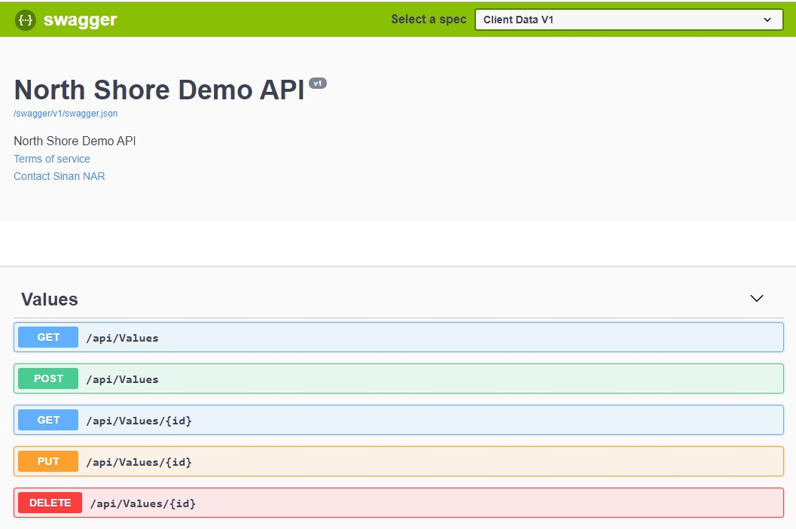
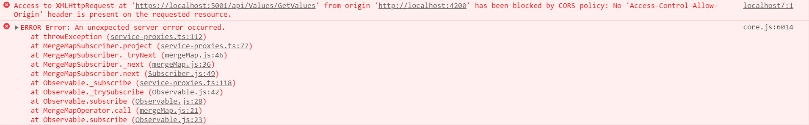
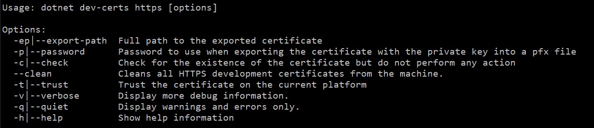

# NorthShoreRestaurant
This repository contains the source code for presentation made by Sinan NAR at North Shore user group <br>
You can swithc between branches to see the progression

---
## Content
1. Angular single page application created by `ng new`
2. Api project folder created and required project created by `dotnet`, `.gitignore` setup for projects
3. Swagger configuration for API
4. nswag configuration for SPA project
5. first api call (ssl cert and cors)
6. Entity Framework integration, creation of entities and first migration
7. Repository implementations
8. Service implementations
9. API implementations
10. bootstrap integration
11. Restaurant and subcomponents implemented
12. Authentication & Authorization with aspnet identity

---
## 1 Angular Single Page Application
we will run `ng new NorthShoreSpa` in the root folder<br>
* `ng new NorthShoreSpa`
```
    ? Would you like to add Angular routing? Yes
    ? Which stylesheet format would you like to use? CSS
```

---
## 2 Aspnet Web Api Project
create a folder `NorthShoreApi` with `mkdir` and get into it with `cd`<br>
* `mkdir NorthShoreApi`

create a solution file named as `NorthShoreApi` with dotnet cli<br> 
* `dotnet new sln -n NorthShoreApi`

create required projects
* `dotnet new webapi -n NorthShore.Application`
* `dotnet new classlib -n NorthShore.Domain`
* `dotnet new classlib -n NorthShore.EfContext`
* `dotnet new classlib -n NorthShore.Infrastructure`
* `dotnet new classlib -n NorthShore.Payload`

add projects to sln
* `dotnet sln .\NorthShoreApi.sln add .\NorthShore.Application\NorthShore.Application.csproj` 
* `dotnet sln .\NorthShoreApi.sln add .\NorthShore.Domain\NorthShore.Domain.csproj` 
* `dotnet sln .\NorthShoreApi.sln add .\NorthShore.EfContext\NorthShore.EfContext.csproj` 
* `dotnet sln .\NorthShoreApi.sln add .\NorthShore.Infrastructure\NorthShore.Infrastructure.csproj` 
* `dotnet sln .\NorthShoreApi.sln add .\NorthShore.Payload\NorthShore.Payload.csproj` 

---
## 3 Swagger Configuration for Web Api
Add swashbuckle aspnet core package to Api project
* `dotnet add package Swashbuckle.AspNetCore`

Configure Startup.cs with followings
```
public class Startup
{
    public void ConfigureServices(IServiceCollection services)
    {
        ...
        // Swagger setup
        services.AddSwaggerGen(c => {
            c.SwaggerDoc("v1", new Info
            {
                Version = "v1",
                Title = "North Shore Demo API",
                Description = "North Shore Demo API",
                TermsOfService = "None",
                Contact = new Contact() { Name = "Sinan NAR", Email = "sinan.nar@gmail.com" }
            });
        });
        ...
    }

    public void Configure(IApplicationBuilder app, IHostingEnvironment env)
    {
        ...
        app.UseSwagger();
        app.UseSwaggerUI(c =>
        {
            c.SwaggerEndpoint("/swagger/v1/swagger.json", "Client Data V1");
        });
        ...
    }
}
```

visiting `https://localhost:5001/swagger/index.html` should show following


---
## 4 NSwag Setup for Angular Spa Project
Install nswag via npm<br>
* `npm install nswag`

create nswag folder
* `mkdir nswag`

create `service.config.nswag` and `refresh.bat` files.<br>
When you run `refresh.bat` in nswag folder, it will create `\NorthShoreSpa\src\shared\service-proxies.ts` file<br>
`service-proxies.ts` contains view models and services for apis<br>

---
## 5. First api call (ssl cert and cors)
1. change ValuesController route attribute as shown `[Route("api/[controller]/[action]")]`
2. regenerate service proxies
3. import `HttpClientModule` and app.module.ts
4. set base url for service proxies as shown below
```
...
import { environment } from '../environments/environment';
import { API_BASE_URL as api_url } from '../shared/service-proxies';
export function getRemoteServiceBaseUrl(): string {
  return environment.backEndUrl;
}
...
@NgModule({
  ...
  providers: [
    { provide: api_url, useFactory: getRemoteServiceBaseUrl },
  ],
  ...
})
export class AppModule { }
```
5. inject ValuesServiceProxy into `app.component.ts` and do api call at ngOnInit, and show values on `app.component.html`
6. update environment files which are `environment.ts` and `environment.prod.ts`

After all of these, see the CORS problem on network or console tab of chrome dev tools as shown


7. Solve CORS as shown below on Startup.cs
``` 
public class Startup
{
    public void ConfigureServices(IServiceCollection services)
    {
        ...
        services.AddCors(options =>
        {
            options.AddPolicy(_defaultCorsPolicyName, builder =>
            {
                builder
                    .AllowAnyOrigin()
                    .AllowAnyHeader()
                    .AllowAnyMethod()
                    .AllowCredentials();
            });
        });
        ...
    }

    public void Configure(IApplicationBuilder app, IHostingEnvironment env)
    {
        ...
        app.UseCors(_defaultCorsPolicyName);
        ...
    }
}
```

After these, if ssl cert problem appears, use dotnet cli to 

```
$ dotnet dev-certs https --clean
$ dotnet dev-certs https --trust
```
---
## Entity Framework integration, creation of entities and first migration

---
## Repository implementations

---
## Service implementations

---
## API implementations

---
## Bootstrap integration

---
## Restaurant and subcomponen implementations

---
## Authentication & Authorization with aspnet identity

---
